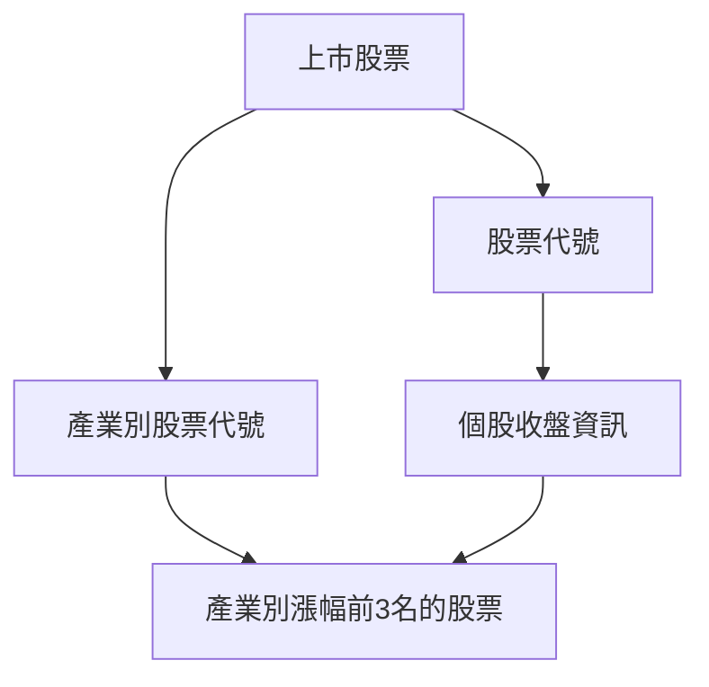

# Taiwan Stock Crawler (每個交易日抓取上市股票以及收盤價資訊)


## 流程如下:


## 第一部分
step1: 先爬取個股資訊包含個股代號及產業別，存成一個股票代號的list及一個dictionary存產業別對應的股票代號，以供接下來流程使用．
step2: 將股票代號存成的list去對應每個股票的收盤資訊，總共有900多個個股收盤資訊，一一爬下．
step3: 在爬的時候，如果爬取速度過於頻繁，爬取網頁的伺服器端會暫時擋下爬取的IP．
step4: 因此這邊有兩種做法．第一種是使用proxy代理來換置IP，第二種是使用延遲的方式爬取之間隨機暫停幾秒
step5: 這邊選擇第二種方式，因為第一種方式沒辦法保證免費的proxy可以穩定爬取
step6: 當開始爬取後，有時還是會遇到擋下的情況，若連續爬取失敗三次，則先跳過繼續爬取下一個股票代號
step7: 將連續爬取失敗3次的股票代號先用List存起來，等到全部跑完後，再重新爬取失敗的股票代號，這邊使用Recursion algorithm，會不斷爬取到成功為止．
step8: 將爬到的個股收盤資訊存成listed.json，用剛剛做好的產業別對應的股票代號（dictionary)，去做mapping，然後將產業別個股資訊漲幅做排序，挑出前三名後，將其資訊存成json檔

## 數據結果
會得到個股收盤資訊，存成listed.json
會得到產業別漲幅前三名的個股資訊 {category}_top3.json

## 第二部分
## Run the Service
You can start the airflow service with the following command.
```
docker-compose -f docker-compose-LocalExecutor.yml up -d
```

## Stop the Service
If you want to stop airflow service execute thr following command.
```
docker-compose -f docker-compose-LocalExecutor.yml stop
```

## Enter Docker Container
```
docker exec -it {docker_container} /bin/bash
```

## Install Python Custome Package For Airflow Service
Add the python package your want to install in the `requirements.txt`.


