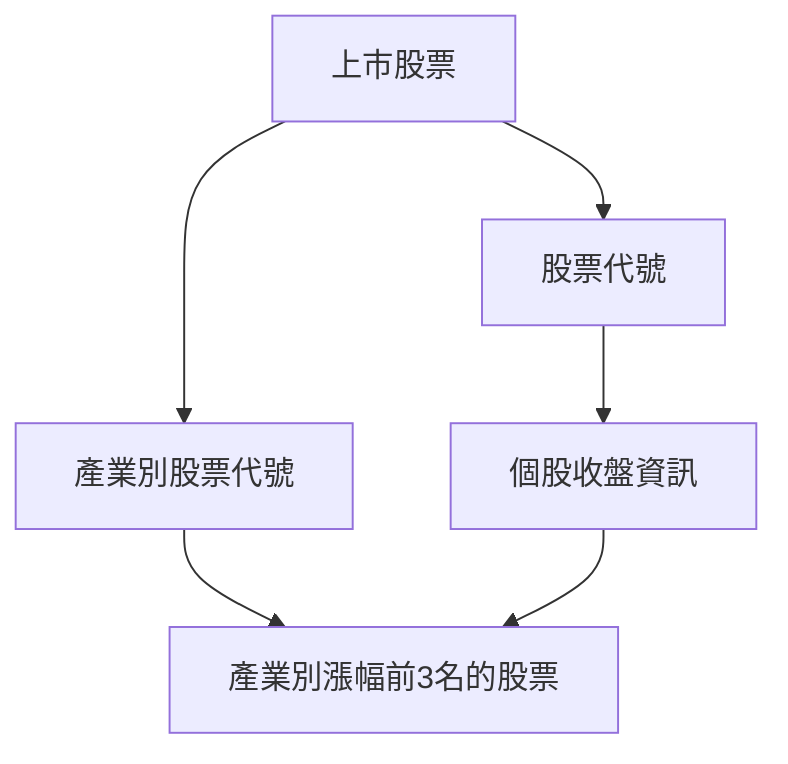
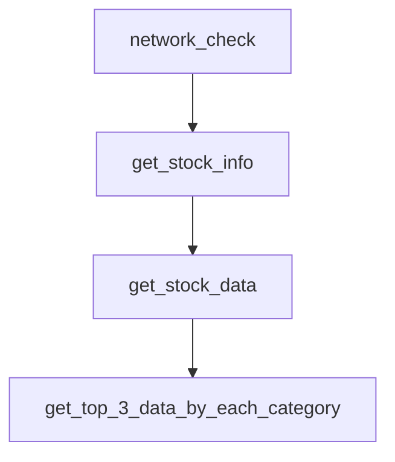

# Taiwan Stock Crawler (每個交易日抓取上市股票以及收盤價資訊)


## 流程如下:


## 第一部分
```
step1: 先爬取個股資訊包含個股代號及產業別，存成一個股票代號的list
       及一個dictionary存產業別對應的股票代號以供接下來流程使用

相關連結:
台股上市證券代號及名稱：https://isin.twse.com.tw/isin/C_public.jsp?strMode=2 
```
```
step2: 將股票代號存成的list去對應每個股票的收盤資訊，爬取個股收盤資訊
       
相關連結:
每日收盤價：https://www.twse.com.tw/exchangeReport/STOCK_DAY?date=20220512&stockNo=2330
```
```
step3: 在爬的時候，如果爬取速度過於頻繁，爬取網頁的伺服器端會暫時擋下爬取的IP
```
```
step4: 因此這邊有兩種做法．第一種是使用proxy代理來換置IP，第二種是使用延遲的方式爬取之間隨機暫停幾秒
```
```
step5: 這邊選擇第二種方式，因為第一種方式沒辦法保證免費的proxy可以穩定爬取
```
```
step6: 當開始爬取後，有時還是會遇到擋下的情況，若連續爬取失敗三次，則先跳過繼續爬取下一個股票代號
```
```
step7: 將連續爬取失敗3次的股票代號先用List存起來，等到全部跑完後，再重新爬取失敗的股票代號，
       這邊使用Recursion algorithm，會不斷爬取到成功為止
```
```
step8: 將爬到的個股收盤資訊存成listed.json，用剛剛做好的產業別對應的股票代號（dictionary)，去做mapping，
       然後將產業別個股資訊漲幅做排序，挑出前三名後，將其資訊存成json檔
```
```
corner case: step1所獲得的股票代號list，其中有極少股票會出現未開盤的狀況，因此在爬取個股股票時，
            未開盤股票無法獲得資訊，則另外處理，將其存成 ex: {"6172": "很抱歉，沒有符合條件的資料!"}
```

## 數據結果
```
會得到個股收盤資訊，存成listed.json
會得到產業別漲幅前三名的個股資訊 {category}_top3.json
這些數據會存在容器及local裡的data folder
```

## 第二部分
Apache Airflow是一種可以監控cron job的工具，用Docker打包Apache Airflow，來做部署
## 設計Data Flow 如下

## 解釋流程
```
network_check: 檢查網路狀況
```
get_stock_info: 抓取上市股票代號及類別，return 股票代號list 及 產業別對應的股票代號 Dictionary
```
```
get_stock_data: 使用get_stock_info的股票代號list來mapping個股資訊，進行爬取，存成listed.json
```
```
get_top_3_data_by_each_category: 使用get_stock_info裡的產業別對應的股票代號 Dictionary
                                 以及讀取listed.json來做mapping，生成{category}_top3.json
```

```
## Run the Service
```
You can start the airflow service with the following command.
```
git clone https://github.com/Brady-Huang/tw-stock-crawler.git
cd tw-stock-crawler
docker-compose -f docker-compose-LocalExecutor.yml up -d
```

## Stop the Service
If you want to stop airflow service execute thr following command.
```
docker-compose -f docker-compose-LocalExecutor.yml stop
```

## Enter Docker Container
```
docker exec -it {docker_container} /bin/bash
```

## Install Python Custome Package For Airflow Service
Add the python package your want to install in the `requirements.txt`.


