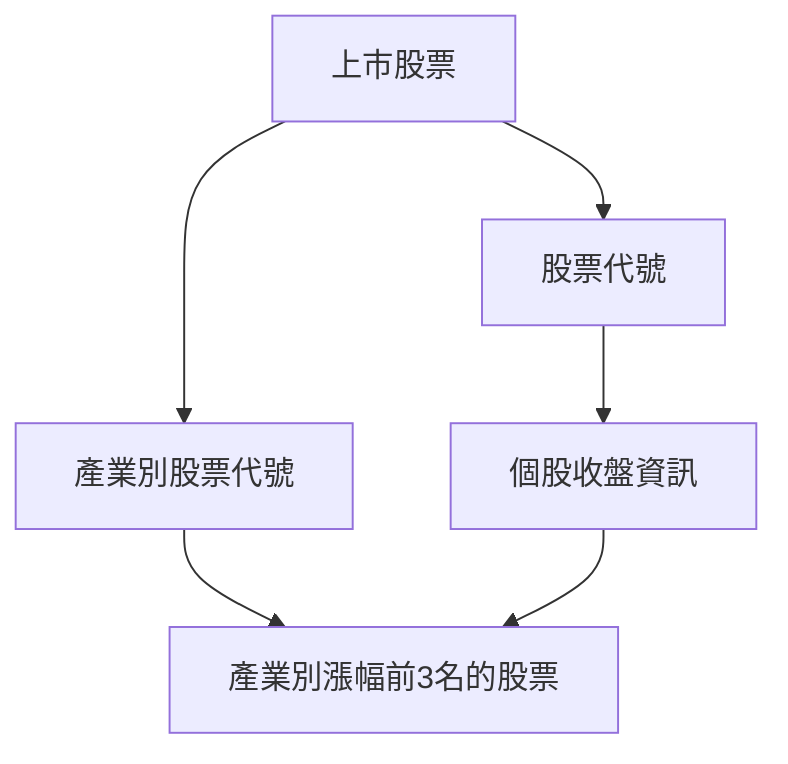

# Taiwan Stock Crawler

## 撰寫一個 Python 專案，每個交易日抓取上市股票以及收盤價資訊


## Run the Service
You can start the airflow service with the following command.
```
docker-compose -f docker-compose-LocalExecutor.yml up -d
```

## Stop the Service
If you want to stop airflow service execute thr following command.
```
docker-compose -f docker-compose-LocalExecutor.yml stop
```

## Enter Docker Container
```
docker exec -it {docker_container} /bin/bash
```

## Install Python Custome Package For Airflow Service
Add the python package your want to install in the `requirements.txt`.


